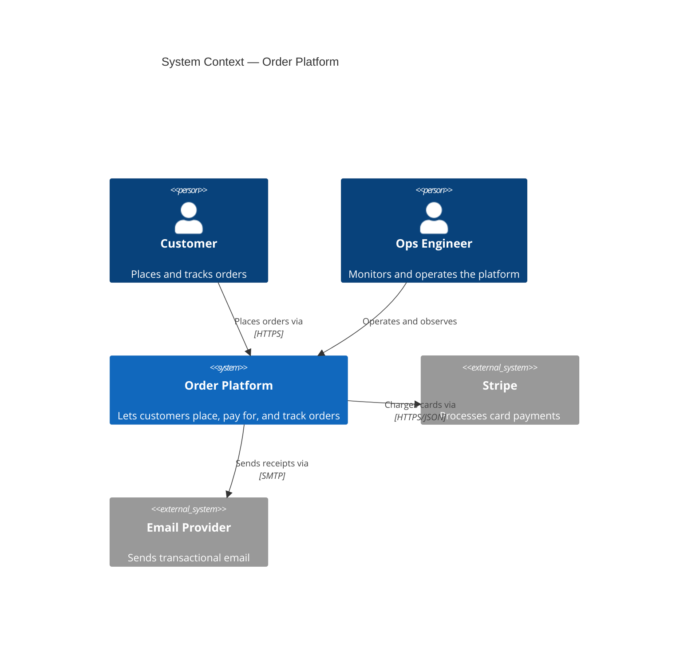
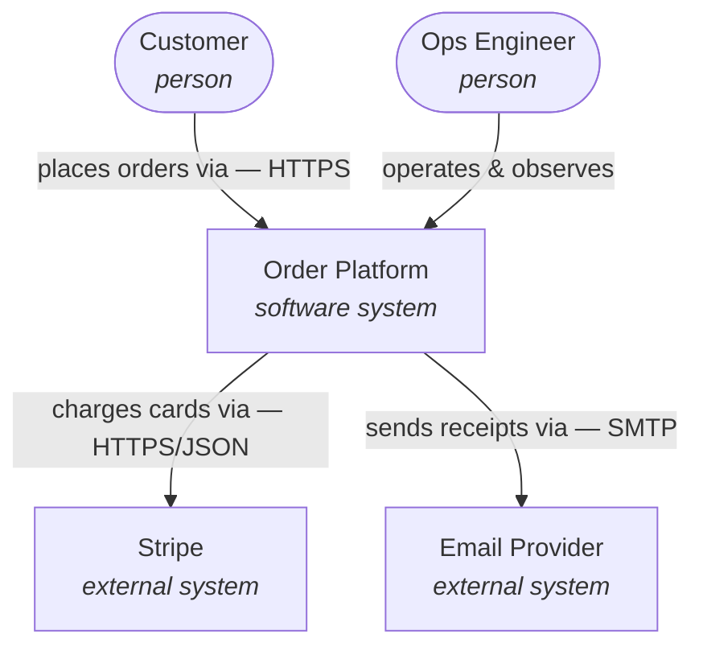
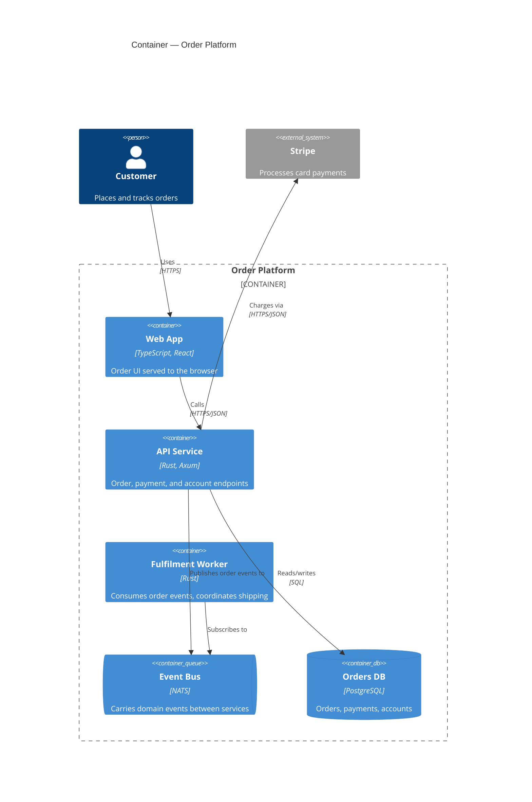
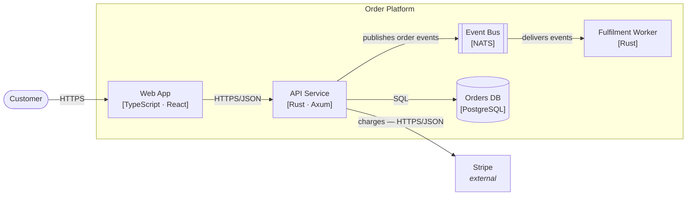
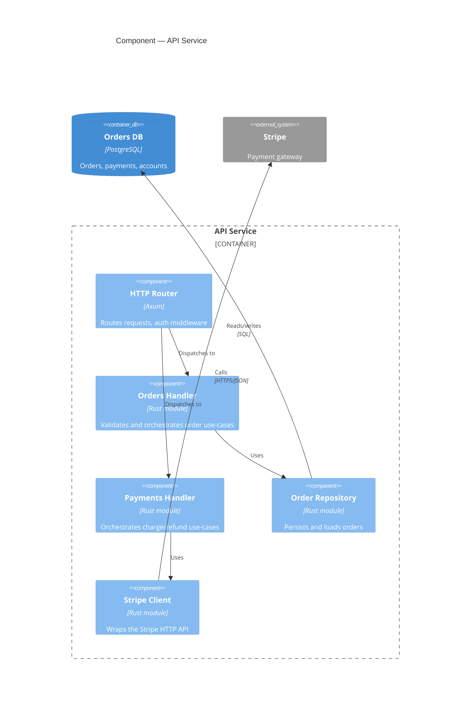
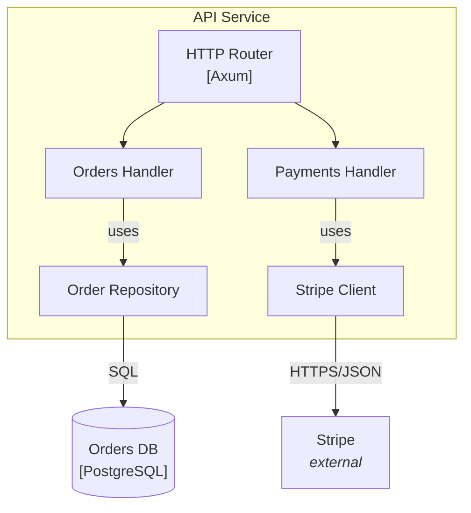
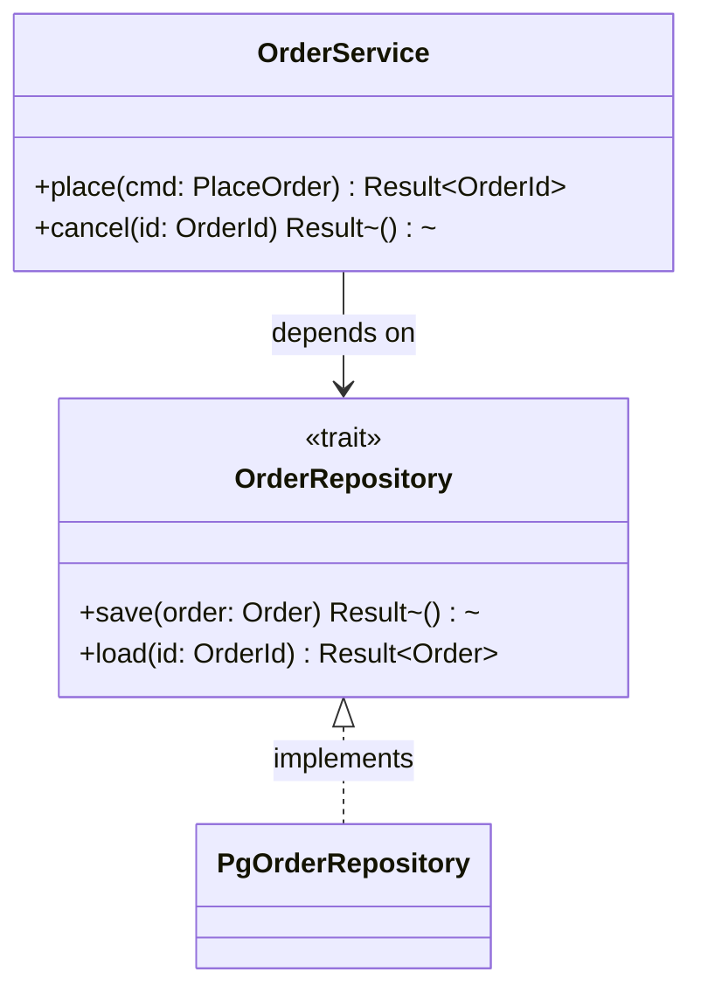
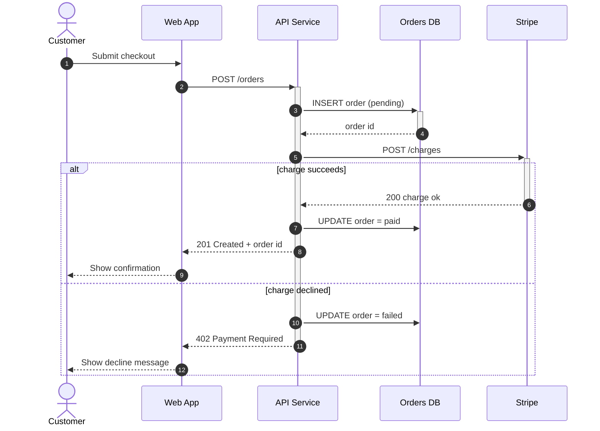
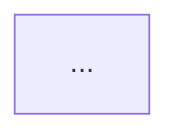

# C4 + Mermaid templates (copy-paste)

Copy the block for the level you need, then replace every placeholder with a real
component name and a real technology or relationship. Each structural level has a
`C4*` template AND a plain-diagram fallback — read the caveat first to choose.

## Contents

- [Caveat: C4 types are experimental](#caveat-c4-types-are-experimental)
- [L1 — System Context](#l1--system-context)
- [L2 — Container](#l2--container)
- [L3 — Component](#l3--component)
- [L4 — Code (usually skip)](#l4--code-usually-skip)
- [Data flow — sequence diagram](#data-flow--sequence-diagram)
- [Embedding in a .md](#embedding-in-a-md)

## Caveat: C4 types are experimental

The `C4Context` / `C4Container` / `C4Component` diagram types are marked
experimental in Mermaid: auto-layout is unstable, spacing is hard to control, and
output varies across Mermaid versions and renderers. Use them when you want C4's
labelled shapes and boundaries out of the box. When you need reliable layout or
maximum renderer portability, use the **plain fallback** (`flowchart` / `graph` /
`sequenceDiagram`) — those are stable everywhere GitHub-flavored Mermaid renders.
The fallbacks below reproduce the same structure with ordinary shapes.

---

## L1 — System Context

The system as one box, plus the people and external systems it interacts with.
Keep it to under ~10 boxes.

### C4Context



### Plain fallback (flowchart)



*Caption example: L1 System Context. Rounded = people, plain boxes = software systems, arrows = interactions labelled with protocol.*

---

## L2 — Container

Zoom into the one system from L1. Each box is a separately deployable/runnable
thing: a web app, an API service, a datastore, a message broker.

### C4Container



### Plain fallback (graph LR)



*Caption example: L2 Container view. Boxes = deployable units, `[[…]]` = message bus, cylinder = datastore; arrows labelled with protocol, synchronous unless noted.*

---

## L3 — Component

Zoom into ONE container from L2 (here, the API Service). Boxes are the major
internal parts — modules, handlers, repositories — not classes.

### C4Component



### Plain fallback (flowchart)



*Caption example: L3 Component view of the API Service. Boxes = internal modules; only this container's insides are shown, neighbours are drawn as context.*

---

## L4 — Code (usually skip)

C4 level 4 shows classes/functions inside one component. It duplicates what an IDE
or `cargo doc` already shows and goes stale fast — **default to omitting it.** Draw
one only for a genuinely intricate design worth freezing in prose. Mermaid has no
`C4Code` type; use a `classDiagram`:



---

## Data flow — sequence diagram

For ONE scenario, show the ordered messages between containers/components over
time. `autonumber` numbers the steps; `activate`/`deactivate` (or `+`/`-`) show
who is doing work; `alt`/`opt`/`loop` express branching.



*Caption example: Checkout data flow. Vertical = time downward, solid arrow = request, dashed = response; the `alt` block shows the success vs. declined paths.*

---

## Embedding in a .md

Paste the chosen diagram into a fenced block tagged `mermaid`, under a heading that
names the level, with an italic caption carrying the legend:

````markdown
## System Context


*L1 System Context. Rounded = people, boxes = systems, arrows labelled with protocol.*
````

GitHub, GitLab, Obsidian, and most static-site generators render `mermaid` blocks
inline. To preview locally, use the Mermaid CLI (`mmdc`) or paste into the Mermaid
Live Editor.
