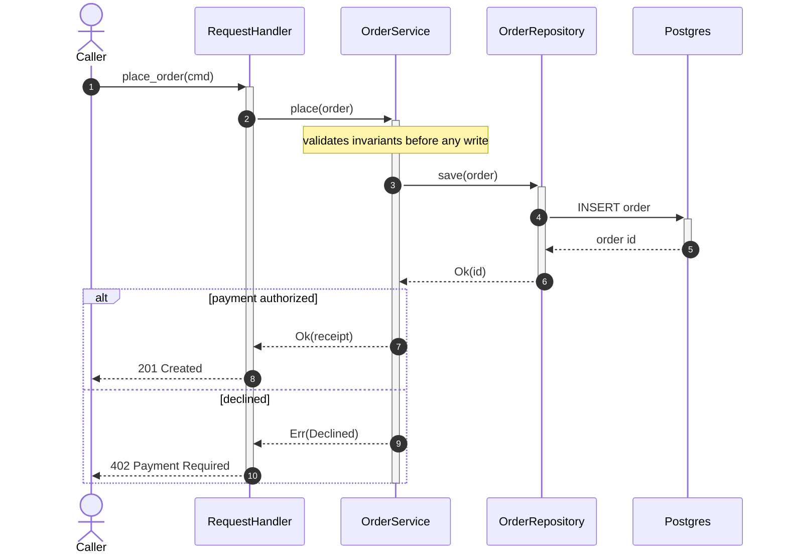
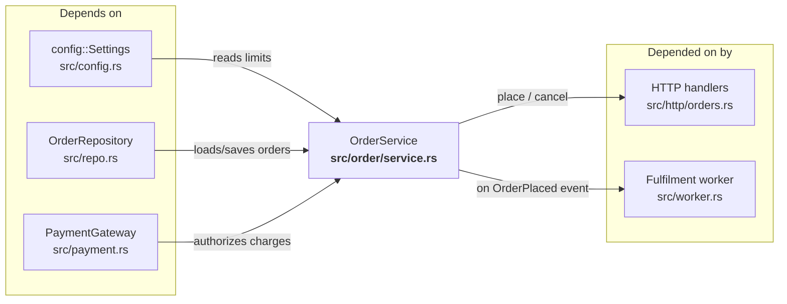
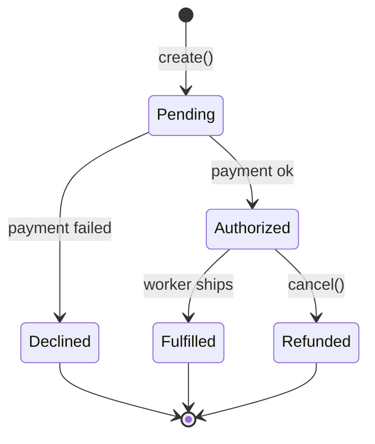

# Diagram patterns (copy-paste)

Two diagrams carry an `explain-module` explanation: a **sequence diagram** for data
flow and a **flowchart** for the dependency graph. A **state diagram** is a third
option when the module is a state machine. Copy the block, then replace EVERY
placeholder with a real symbol from the code you read — a diagram of `ModuleA`,
`foo`, and unlabelled arrows documents nothing.

All three are stable, portable Mermaid types (no experimental C4 syntax); they
render inline on GitHub, GitLab, Obsidian, and most doc tools.

## Contents

- [Data flow — sequenceDiagram](#data-flow--sequencediagram)
- [Dependency graph — flowchart (both directions)](#dependency-graph--flowchart-both-directions)
- [State machine — stateDiagram (optional)](#state-machine--statediagram-optional)
- [Embedding in a .md](#embedding-in-a-md)

---

## Data flow — sequenceDiagram

One scenario, ordered top to bottom. `autonumber` numbers the steps.
`->>` is a synchronous call (control waits); `-->>` is the return/async reply.
`activate`/`deactivate` (or the `+`/`-` shorthand on arrows) show who is doing
work. `Note` marks a decision, a cache hit, or a constraint. `alt`/`opt`/`loop`
express branching.



*Caption: Data flow for `place_order`. Vertical = time downward, solid arrow =
call, dashed = return; the `alt` block shows the authorized vs declined paths.*

- **Solid vs dashed is load-bearing** — `->>` is "I call and wait", `-->>` is "the
  reply comes back". Do not draw every arrow solid.
- **A participant is a real type/module/service**, aliased to a short name with
  `as`. Keep it to the participants the scenario actually touches.

---

## Dependency graph — flowchart (both directions)

Show BOTH what the module depends on (upstream, feeds INTO it) and what depends on
the module (downstream, consumes it). The module under explanation is the center
node; put upstream on the left/top and downstream on the right/bottom. Label every
edge with what crosses it.



*Caption: Dependency graph for `OrderService`. Left = what it uses, right = its
consumers; edge labels name the call or event. Arrows point in the direction data
/ control flows.*

- **Both directions or it is not a dependency graph.** A one-sided "what it imports"
  list misses the blast radius of a change, which is the reason to draw it.
- **Node text = real symbol + real file** (`OrderService<br/>src/order/service.rs`).
  Bold the center node so the eye lands on it.
- **Respect the layering** — arrows should point the legal way for the codebase's
  architecture (e.g. presentation → application → infrastructure ← domain). A
  backwards arrow in the graph is either a bug you found or a mislabel; check which.

---

## State machine — stateDiagram (optional)

Use ONLY when the module is genuinely a state machine (a connection lifecycle, a
job status, a retry loop). Otherwise the sequence + dependency pair is enough.



*Caption: Order lifecycle. Each edge label is the event/method that drives the
transition; `[*]` is the start/terminal state.*

---

## Embedding in a .md

Paste the chosen diagram into a fenced block tagged `mermaid`, under a heading that
names the section, with an italic caption carrying the legend:

````markdown
## Data Flow

```mermaid
sequenceDiagram
    ...
```
*Data flow for `place_order`. Solid = call, dashed = return.*
````

To preview locally, use the Mermaid CLI (`mmdc`) or paste into the Mermaid Live
Editor.
